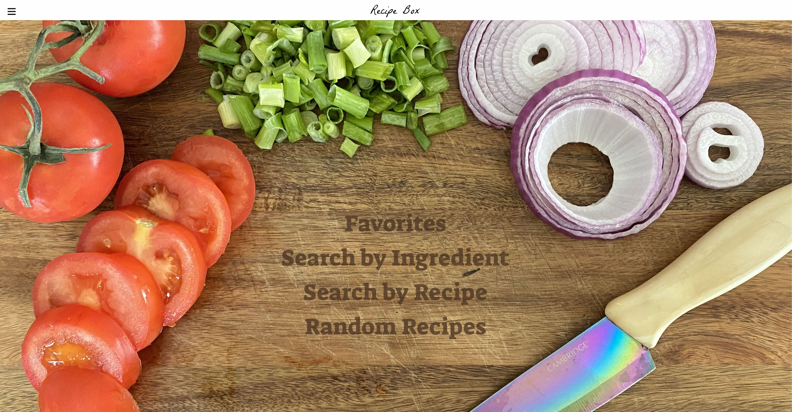

# Recipe-Box

## Description

Recipe-Box that allows users to save their favorites, search by ingredient, search by recipe name and get a random recipe. Users will get a beer pairing as well. 

## Developers
* Andrew Hudgins
* Morgan Holcomb
* Madalyne Cross

## Recipe-Box Images

​
## Tech Stack
* Built with: Javascript, CSS, HTML 
* Other Libraries: Foundation CSS, JQuery, Google Fonts
​
​
## APIs
* Edamam API
* Punk API
​
## On the project learning:
* New CSS Framework
* Server Side API functionality
* Modals 
* Project Board in GitHub

## MVP (Minimum Viable Product)

User has ingredients, they want to see what recipes are available and what additional ingredients they will need. 
​​
## Stretch Goals
* Random recipe, recipe by name, favorite recipes
* Beer Pairing

## Future Development
* User input for excluding ingredients such as popular allergens
* Populating small emblems on the recipe cards for popular diets (e.g., gluten-free, vegetarian, pescatarian, vegan)
* The ability to refine results based on diet type (e.g., healthy, heart-healthy, etc.)
* Create the modals dynamically in a for loop based so all recipe cards can utilize them
* Refactor the scripts into one
​

## Website
Visit the [project](https://ahudg.github.io/recipe-box/)

